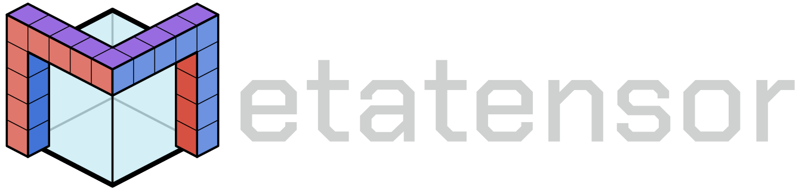

# Welcome to the metatensor team homepage

We develop software to enable modularity and colaboration in atomistic machine learning; through data, models and architecture exchange.

We have three main projects:

- [metatensor](https://github.com/metatensor/metatensor) is a generic self-describing sparse data format, that can be used by multiple pieces of code to exchange data without knowing about each other;
- [metatomic](https://github.com/metatensor/metatomic) is a interface to execute arbitrary atomistic machine learning models in arbitrary simulation engines;
- [metatrain](https://github.com/metatensor/metatrain) is a command line tool to train state of the art atomistic machine learning models on custom datasets, and expand the capabilities of existing model architectures.

We also have a couple of projects built on top of the above three:

- [featomic](https://github.com/metatensor/featomic) is a tool to compute machine learning features for atomistic systems, which can then be used in larger models
- [lammps-metatomic](https://github.com/metatensor/lammps) is our fork of [LAMMPS](https://github.com/lammps/lammps) with added support for metatomic models
